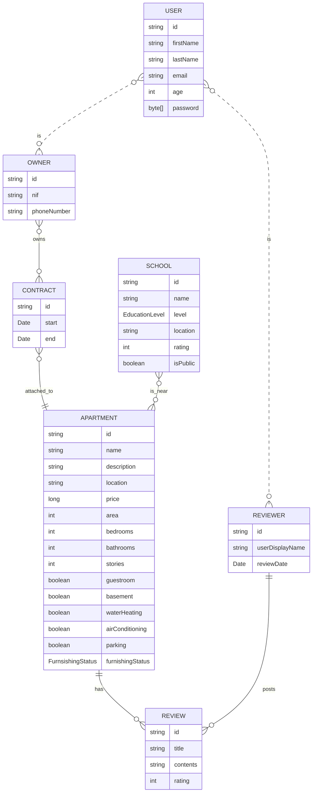
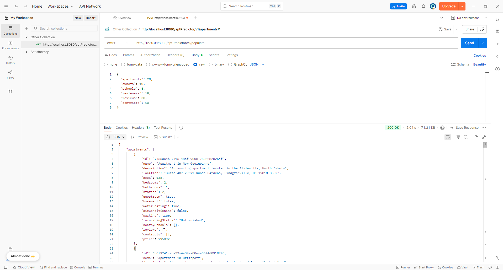

# Apartment Predictor API

[Github Repo Link](https://github.com/Decinco/ApartmentPredictor/tree/pra02-main)

## Product Goal

The Apartment Predictor API serves as the main backend for the Apartment Predictor application. It acts as both a database and a rest API service which stores and exposes data about Apartments, the Contracts that bind them to their Owners, and nearby Schools, as well as Reviews and Reviewers for the Apartments. This data can then be read or changed by the frontend via the aforementioned endpoints.

## Technical Details

The backend uses the following classes:



### Apartment

Apartment returns the following values:

```json
{
    "id": "d23a6852-f6e8-4e76-92d5-f47263df751b",
    "name": "Apartment in Prosaccoshire",
    "description": "An amazing apartment located in the Port Summer, Maryland",
    "location": "Apt. 749 745 Lockman Lock, West Branden, VT 50710",
    "area": 170,
    "bedrooms": 3,
    "bathrooms": 2,
    "stories": 2,
    "guestroom": true,
    "basement": true,
    "waterHeating": true,
    "airConditioning": false,
    "parking": false,
    "furnishingStatus": "Unfurnished",
    "nearbySchools": [],
    "reviews": [],
    "contracts": []
}
```

*furnishingStatus* can be "Unfurnished", "Partially Furnished" or "Fully Furnished"

### Contract

Contract returns the following values:

```json
{
    "id": "bf6a38f2-3b16-4ed2-87c9-fcd99a33f34f",
    "startDate": "2024-10-21T20:22:08.965+00:00",
    "endDate": "2025-06-18T07:55:51.029+00:00",
    "attachedApartment": {},
    "owner": {}
}
```

### School

School returns the following values:

```json
{
    "id": "e3e829b8-428f-42ab-ab5e-92d536fdb86b",
    "name": "School in North Joanchester",
    "levels": [
        "CFGM",
        "Primaria"
    ],
    "location": "Suite 715 35869 Bahringer Track, North Keenaview, RI 99400-0010",
    "rating": 1,
    "nearbyApartments": [],
    "public": false
}
```

*levels* is a list of EducationLevel, an Enum defining what education levels can be set. They're based on existing Spanish education levels.

### Review

Review returns the following values:

```json
{
    "id": "8c59fdca-b3b3-4a60-9cec-d380d45a54a9",
    "title": "0w8r1kkjt9qzxjgqas",
    "contents": "dpsf9iywris40gs1p255gedhurgog3z104wo4i1a3p1uhe29iodu3m9bskmu1zbj466n573x87h5wekzmv659ll11qxezwreoehui5za7mzvto9",
    "rating": 3,
    "date": "2023-11-13T09:30:23.199+00:00",
    "apartment": {},
    "reviewer": {},
}
```

### User

User returns *at least* the following values:

```json
{
    "id": "1ce3c547-1482-40b1-b1d5-ea54a2cdd0fa",
    "firstName": "Kermit",
    "lastName": "Rempel",
    "email": "dortha.zieme8@decin.co",
    "age": 22,
}
```

User uses InheritanceType TABLE_PER_CLASS, which means both it and inheriting classes have a table with all possible fields (those from User and additional specific ones) in the database. This allows the api to get all the users, regardless of the category, and execute queries on them.

The main reason why this method was chosen over @MappedSuperclass was potentially making login more straightforward, as all the users can conveniently be found in a single table. The poor performance is not a concern as the class only serves as a parent for one "layer" of classes: no class will ever inherit from owner or reviewer.

User has a WIP password field. This field will not be shown through the API if not necessary.

### Reviewer: User

Reviewer returns the following values:

```json
{
    "id": "9b9b6a2c-0ebc-4daa-920a-1cfef0b059f0",
    "firstName": "Charles",
    "lastName": "Ziemann",
    "email": "shela.thompson0@decin.co",
    "age": 31,
    "username": "arielzemlak12",
    "reviews": []
}
```

### Owner: User

Owner returns the following values:

```json
{
    "id": "a00d8c66-b895-4017-9c55-104ab8bfc3af",
    "firstName": "Addie",
    "lastName": "Mayer",
    "email": "jill.nikolaus2@decin.co",
    "age": 56,
    "nif": "23739547N",
    "phoneNumber": "614716099",
    "contracts": []
},
```

## API

The backend exposes a basic REST API which allows for the execution of any CRUD operation. Endpoints are exposed for every entity following this structure:

- **GET "aptPredictor/v1/{entityType}s"** (Shows a list of all objects)
- **GET "aptPredictor/v1/{entityType}s/{id}"** (Gets a specific object)
- **POST "aptPredictor/v1/{entityType}s/create"** (Creates a new object, requires object in body)
- **PUT "aptPredictor/v1/{entityType}s/update"** (Updates an object, requires object in body)
- **DELETE "aptPredictor/v1/{entityType}s/delete/{id}"** (Deletes a given object)

GET endpoints return the queried objects, POST and PUT endpoints return the object that was created/updated and the DELETE endpoint returns a message confirming the deletion.

None of these endpoints have exception handling for now, so error messages are not yet formatted.

### Populating The Database

The API also exposes a POST endpoint at aptPredictor/v1/populate that populates the database with dummy data. A body must be passed to it containing the amount of each entity to generate with the following structure:

```json
{
  "apartments": 20,
  "owners": 10,
  "schools": 5,
  "reviewers": 15,
  "reviews": 30,
  "contracts": 10
}
```

The endpoint then returns the generated data.


All examples have been generated with the populator.
