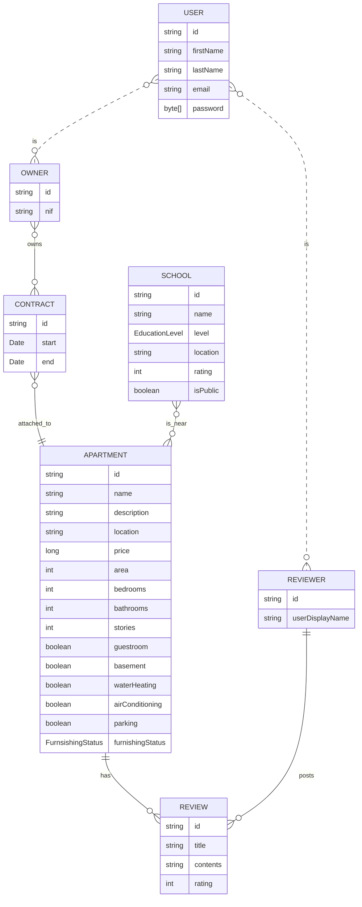

# Apartment Predictor API

## Product Goal

The Apartment Predictor API serves as the main backend for the Apartment Predictor application. It acts as both a database and a rest API service which stores and exposes data about Apartments, the Contracts that bind them to their Owners, and nearby Schools, as well as Reviews and Reviewers for the Apartments. This data can then be read or changed by the frontend via the aforementioned endpoints.

## Technical Details

The backend uses the following classes:

### Apartment

### Contract

### School

### Review

### User

### Reviewer: User

### Owner: User
